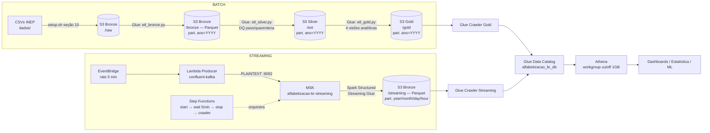

# Tech Challenge — Fase 2 | Pipeline Híbrido para Análise da Alfabetização no Brasil

Pipeline híbrida de dados (**Batch + Streaming**) na AWS, com **Arquitetura Medalhão** (Bronze → Silver → Gold), para analisar o **Indicador Criança Alfabetizada** (INEP/Saeb) e compará-lo com as metas nacionais, estaduais e municipais do Compromisso Nacional Criança Alfabetizada.

> **POSTECH AI Scientist — Tech Challenge Fase 2**

---

## 1. Contexto do problema

A alfabetização na infância é um dos pilares do desenvolvimento educacional, social e econômico do país. O **Compromisso Nacional Criança Alfabetizada** mobiliza União, estados, DF e municípios para garantir que toda criança brasileira esteja alfabetizada até o final do **2º ano do ensino fundamental**.

Para dar régua a essa política, o INEP realizou em 2023 a pesquisa **Alfabetiza Brasil**, que definiu o ponto de corte de **743 pontos na escala de proficiência do Saeb**: a criança que atinge esse patamar é considerada alfabetizada. Nasceu daí o **Indicador Criança Alfabetizada (ICA)** — o percentual de estudantes que atingem essa proficiência — com meta nacional de 100% até **2030** e metas intermediárias pactuadas por UF e por município.

O desafio de engenharia é que resultados e metas vêm de **fontes heterogêneas** (indicador por município, indicador por UF, metas Brasil/UF/município), em granularidades e formatos diferentes, e ainda chegam **atualizações contínuas de medições** ao longo do tempo. Integrar tudo com qualidade é o que permite análises de desigualdade educacional e **políticas públicas baseadas em evidências**.

## 2. Fontes de dados

Dados reais da plataforma [Base dos Dados — Indicador Criança Alfabetizada](https://basedosdados.org/dataset/073a39d4-89cf-4068-b1e8-34ed0d9c0b72) (origem INEP), versionados em [`dados/`](dados/):

| Entidade | Arquivo | Linhas | Modo |
|---|---|---:|---|
| Indicador por município | `br_inep_avaliacao_alfabetizacao_municipio.csv` | 23.995 | Batch |
| Indicador por UF | `br_inep_avaliacao_alfabetizacao_uf.csv` | 145 | Batch |
| Meta Brasil | `..._meta_alfabetizacao_brasil.csv` | 3 | Batch |
| Meta por UF | `..._meta_alfabetizacao_uf.csv` | 54 | Batch |
| Meta por município | `..._meta_alfabetizacao_municipio.csv` | 10.704 | Batch |
| Novas medições do indicador | Eventos sintéticos (Lambda Producer → Kafka/MSK) | contínuo | Streaming |

O streaming simula a chegada de **atualizações de indicadores em tempo quase real** (novas medições por município, com o mesmo schema INEP), publicadas num tópico Kafka e consumidas por Spark Structured Streaming.

## 3. Arquitetura proposta



### Fluxo de dados (Arquitetura Medalhão)

1. **RAW** — os 5 CSVs do INEP são enviados a `s3://alfabetizacao-br-dev-bronze/raw/` (seção 10 do `setup.sh`).
2. **Bronze (SOR)** — `etl_bronze.py` lê os CSVs com **schemas explícitos**, adiciona colunas de controle (hash MD5 para deduplicação, timestamp de ingestão) e grava **Parquet particionado por ano** (Hive-style: `bronze/<entidade>/ano=2023/`, `ano=2024/`, ...), preservando o histórico completo de todos os ciclos avaliativos.
3. **Silver (SOT)** — `etl_silver.py` lê **todas as partições de ano** do Bronze, aplica limpeza, padronização de tipos, normalização de chaves (`id_municipio` com 7 dígitos, mapa de redes 0/2/3/5 → total/estadual/municipal/privada) e as **regras de qualidade** (colunas booleanas `_dq_*` consolidadas em `_dq_passou`). Registros aprovados vão para `sot/pass/<entidade>/ano=YYYY/`; reprovados vão para `sot/quarentena/` (particionada pela data de processamento, pois o próprio `ano` pode ser o campo inválido) com `_quarentena_motivo`. É aqui que as bases são integradas.
4. **Gold (SPEC)** — `etl_gold.py` produz 4 visões analíticas prontas para consumo, cada uma particionada por ano (`gold/<visao>/ano=YYYY/`):

| Visão | Descrição |
|---|---|
| `alfabetizacao_por_municipio` | Rede municipal + meta por município: gap e status da meta 2025 |
| `evolucao_temporal` | Agregações por UF/ano/série (média, mín, máx, desvio) |
| `ranking_municipios` | `rank()` por janela UF/ano (Window Function) |
| `comparacao_metas_nacionais` | Taxa por UF × meta nacional × meta estadual |

5. **Streaming** — EventBridge dispara a **Lambda Producer** a cada 5 min, que publica eventos JSON (schema INEP) no tópico MSK `alfabetizacao-br-streaming`. O job **Glue Structured Streaming** (`streaming_glue.py`) consome o tópico, valida com `StructType` explícito, enriquece com a flag `risco_alfabetizacao` (CRITICO < 60% ≤ ATENCAO < 75% ≤ NORMAL) e grava Parquet particionado por `year/month/day/hour` com `checkpointLocation` (semântica *exactly-once*). A **Step Functions** orquestra: inicia o job → aguarda 5 min → para o job → dispara o crawler.
6. **Consumo** — os crawlers catalogam Gold e Streaming no **Glue Data Catalog** e o **Athena** consulta tudo via SQL serverless ([`athena_queries/validacao_gold.sql`](athena_queries/validacao_gold.sql)).

## 4. Estrutura do repositório

```
├── .env.example                      # Modelo das variáveis de ambiente do AWS CLI
├── setup.sh                          # Provisiona toda a infra via AWS CLI (10 seções)
├── cleanup.sh                        # Remove todos os recursos (FinOps!)
├── verificar_limpeza.sh              # Audita se o cleanup.sh removeu tudo (somente leitura)
├── dados/                            # 5 CSVs reais do INEP (Base dos Dados)
├── glue_jobs/
│   ├── etl_bronze.py                 # RAW (CSV) → Bronze (Parquet part. ano=YYYY + hash dedup)
│   ├── etl_silver.py                 # Bronze → Silver (DQ, pass/quarentena, integração)
│   ├── etl_gold.py                   # Silver → Gold (4 visões analíticas part. ano=YYYY)
│   └── streaming_glue.py             # MSK → S3 via Spark Structured Streaming
├── lambda_functions/
│   └── streaming_producer.py         # Publica eventos sintéticos no MSK (confluent-kafka)
├── notebooks/
│   ├── 01_analise_exploratoria.ipynb # EDA das 5 bases INEP (fundamenta as decisões da pipeline)
│   ├── 02_idempotencia_bronze.ipynb  # Verificação de idempotência — camada Bronze
│   ├── 03_idempotencia_silver.ipynb  # Verificação de idempotência — camada Silver
│   ├── 04_idempotencia_gold.ipynb    # Verificação de idempotência — camada Gold
│   └── pipeline_local.py             # Simulação local fiel dos 3 jobs Glue (pandas)
└── athena_queries/
    └── validacao_gold.sql            # Validações de qualidade + queries analíticas
```

## 5. Como executar

Pré-requisitos: AWS CLI com credenciais de administrador (`aws configure` ou `cp .env.example .env` + `source .env`), `python3` e `pip`.

```bash
# 0. Credenciais (alternativa ao aws configure)
cp .env.example .env   # preencha com suas credenciais
source .env

# 1. Provisionar a infraestrutura (~25 min; MSK leva ~15 min para ficar ACTIVE)
bash setup.sh

# 2. Criar o Lambda Layer confluent-kafka e a Lambda Producer
#    (comandos impressos pela seção 7 do setup.sh — descomente o bloco após criar o Layer)

# 3. Pipeline BATCH (aguarde cada job concluir antes do próximo)
aws glue start-job-run --job-name alfabetizacao-br-raw-to-bronze
aws glue start-job-run --job-name alfabetizacao-br-bronze-to-silver
aws glue start-job-run --job-name alfabetizacao-br-silver-to-gold
aws glue start-crawler --name alfabetizacao-br-gold-crawler

# 4. Pipeline STREAMING (orquestrado pela Step Functions;
#    o ARN e o input exato são impressos ao fim do setup.sh)
aws stepfunctions start-execution --state-machine-arn <ARN> --input '{...}'

# 5. Consultar no Athena (workgroup alfabetizacao-br-workgroup)
#    usando athena_queries/validacao_gold.sql

# 6. AO TERMINAR — remover tudo para não gerar custo
bash cleanup.sh

# 7. Auditar a limpeza (somente leitura; ❌ indica recurso remanescente)
bash verificar_limpeza.sh
```

Os notebooks de `notebooks/` rodam localmente (sem AWS): `pip install pandas pyarrow matplotlib seaborn` e execute-os pelo Jupyter/VS Code. Eles documentam a EDA que fundamentou o desenho da pipeline e provam a idempotência dos scripts de preparação de cada camada.

### Execução no AWS Academy (Learner Lab)

A arquitetura **ideal** deste projeto é a híbrida descrita na seção 3 (batch + streaming via MSK). Contas do Learner Lab, porém, bloqueiam duas permissões que ela exige: `iam:CreateRole` e `kafka:CreateCluster` (MSK). O `setup.sh` detecta esse ambiente automaticamente (pela presença da role `LabRole`) e se adapta:

- **IAM**: reutiliza a `LabRole` para Glue, Lambda e Step Functions, em vez de criar roles;
- **Streaming**: entra em **modo batch-only** — pula MSK, job de streaming, Lambda Producer, EventBridge e Step Functions. O pipeline batch completo (S3 → Glue Bronze/Silver/Gold → Data Catalog → Athena) funciona integralmente.

O comportamento é controlado pela variável `STREAMING` (`auto` por padrão): `STREAMING=on bash setup.sh` força o provisionamento híbrido (necessário em conta com permissões plenas); `STREAMING=off` força batch-only em qualquer conta. O código de streaming (`streaming_glue.py`, `streaming_producer.py`) permanece no repositório como a arquitetura alvo — para demonstrá-lo de ponta a ponta, execute o setup numa conta AWS pessoal (~US$ 1/sessão com `cleanup.sh` ao final).

## 6. Tecnologias utilizadas e justificativas

| Tecnologia                            | Papel                                         | Por quê                                                                                             |
| ------------------------------------- | --------------------------------------------- | --------------------------------------------------------------------------------------------------- |
| **S3** (5 buckets)                    | Data Lake (bronze/silver/gold/scripts/athena) | Armazenamento barato, durável e desacoplado da computação                                           |
| **AWS Glue (PySpark)**                | ETL batch e streaming                         | Serverless (paga por job), integrado ao Data Catalog, escala sem gestão de cluster                  |
| **Amazon MSK**                        | Broker Kafka do streaming                     | Kafka gerenciado; padrão de mercado para ingestão de eventos; PLAINTEXT :9092 conforme lab do curso |
| **Lambda + EventBridge**              | Producer de eventos agendado                  | Custo por invocação; simula fontes emitindo atualizações a cada 5 min                               |
| **Step Functions**                    | Orquestração do streaming                     | Controla o ciclo start→wait→stop→crawler sem servidor e com retry/catch nativos                     |
| **Glue Data Catalog + Crawlers**      | Governança/metadados                          | Catálogo central de schemas; descoberta automática de partições                                     |
| **Athena**                            | Camada de consulta                            | SQL serverless sobre Parquet particionado; paga por byte escaneado                                  |
| **AWS CLI (`setup.sh`/`cleanup.sh`)** | IaC                                           | Menos complexidade que Terraform (sem state remoto nem providers); cada recurso é um comando legível e o ciclo criar → verificar → destruir é explícito. Padrão do lab FIAP |

## 7. Decisões arquiteturais (trade-offs)

**Batch vs Streaming** — os indicadores oficiais mudam poucas vezes ao ano: batch é mais barato e simples para a carga histórica. Novas medições, porém, chegam continuamente: streaming via Kafka dá latência de segundos. A arquitetura híbrida usa cada modo onde ele é mais eficiente, convergindo tudo para o mesmo Data Lake.

**Data Lake vs Data Warehouse** — optamos por Data Lake (S3 + Parquet + Athena) em vez de um DW dedicado (ex.: Redshift): custo de armazenamento ~10x menor, schema-on-read flexível para fontes heterogêneas e nenhum cluster ligado 24/7. O trade-off é menor performance em joins massivos — irrelevante no volume atual (~35 mil linhas batch).

**Custo vs Performance** — 2 workers G.1X nos jobs Glue e MSK `kafka.t3.small` × 2 são o mínimo funcional; escalam via parâmetro se o volume crescer. O streaming roda em janelas controladas (Step Functions para o job após 5 min) em vez de 24/7 — corta ~99% do custo de um consumer contínuo, ao custo de latência entre janelas.

**Glue Structured Streaming vs Lambda consumer** — o consumer em Spark dá checkpointing (*exactly-once*), particionamento nativo e o mesmo runtime do batch; uma Lambda consumer exigiria Event Source Mapping, controle manual de offsets e teto de 15 min por execução.

**Particionamento por ano (`ano=YYYY`) vs pastas soltas por ano** — a base cresce um ciclo avaliativo por ano; em vez de pastas manuais, usamos particionamento Hive-style dentro de cada camada (`bronze/<entidade>/ano=2023/` etc.). Ganhos: *partition pruning* no Athena (`WHERE ano = 2024` lê só aquela partição — menos custo), reprocesso idempotente por ano via `partitionOverwriteMode=dynamic` (provado nos notebooks 02–04) e novos ciclos entram como partições novas, sem tocar o histórico. Mantemos **todo o histórico disponível**: indicador só faz sentido em comparação entre anos, e o volume (~35 mil linhas/ciclo em Parquet) custa centavos.

**AWS CLI vs Terraform** — escolha consciente para **diminuir a complexidade da pipeline**: Terraform exigiria state remoto, providers e uma camada de abstração que não se paga num projeto de ambiente único e efêmero (a infra sobe para a demonstração e é destruída em seguida). Com a CLI, cada recurso é um comando explícito e didático; a recuperação de estado usa a seção *sessão perdida* do `setup.sh` e a auditoria fica com o `verificar_limpeza.sh`. Trade-off assumido: sem plan declarativo nem detecção de drift — irrelevante sem ambiente de longa duração. Com múltiplos ambientes e infra permanente, Terraform seria a escolha certa.

## 8. Governança e qualidade de dados

- **Duplicidade**: hash MD5 das colunas de negócio no Bronze; deduplicação no Silver.
- **Valores ausentes**: regras `_dq_*` por entidade (nulos em chaves e métricas obrigatórias).
- **Validação de chaves**: `id_municipio` com 7 dígitos IBGE; `sigla_uf` válida; domínio de `rede` (0/2/3/5).
- **Consistência entre tabelas**: joins de conferência indicador × metas (queries 1–5 de `validacao_gold.sql`).
- **Quarentena**: registro reprovado não é descartado — vai para `sot/quarentena/` com `_quarentena_motivo` (`concat_ws` das regras violadas), permitindo auditoria e reprocesso.
- **Catálogo**: schemas centralizados no Glue Data Catalog; partições descobertas por crawler.
- **Idempotência verificada**: os notebooks [`02`](notebooks/02_idempotencia_bronze.ipynb), [`03`](notebooks/03_idempotencia_silver.ipynb) e [`04`](notebooks/04_idempotencia_gold.ipynb) executam cada camada duas vezes sobre o mesmo insumo e comparam partições, contagens e hashes de conteúdo — garantia de que retries e reprocessos não duplicam nem corrompem o lake.

## 9. Monitoramento

- **CloudWatch Logs**: todos os jobs Glue e a Lambda logam automaticamente; cada job ETL imprime um **SUMÁRIO** final com contagens de entrada, pass e quarentena por entidade — falha de ingestão e volume processado ficam visíveis por execução.
- **CloudWatch Metrics**: métricas nativas de Glue (DPU, records), MSK (bytes in/out por broker) e Lambda (erros, duração) — base para alarmes de erro/latência.
- **Step Functions**: o console mostra o estado de cada etapa do streaming (start/wait/stop/crawler), com `Catch` para falhas no stop do job.
- **Job bookmark** no Glue evita reprocessar dados já lidos no batch.
- **Checkpoint** do Structured Streaming garante retomada sem perda/duplicação após falha.

## 10. FinOps — otimização de custos

- **Parquet + particionamento por ano** (`ano=YYYY` nas três camadas do batch; `year/month/day/hour` no streaming): o formato colunar reduz o volume lido por coluna e o *partition pruning* limita a leitura aos anos filtrados — como as análises do indicador são tipicamente por ciclo (`WHERE ano = 2024`), o custo por query cai em ordem de grandeza vs CSV sem partição, e cresce de forma controlada conforme novos anos entram na base.
- **Athena workgroup com cutoff de 1 GB** por query: proteção contra full-scan acidental.
- **S3 Lifecycle no Bronze**: Standard → Standard-IA (30 dias) → Glacier (90 dias).
- **S3 VPC Gateway Endpoint**: tráfego Glue↔S3 sem custo de NAT.
- **Streaming em janelas**: Step Functions para o job Glue após 5 min; EventBridge produz eventos só a cada 5 min.
- **Dimensionamento mínimo**: 2× G.1X no Glue, `kafka.t3.small` × 2 com 10 GB EBS, Lambda 256 MB.
- **`cleanup.sh` + `verificar_limpeza.sh`**: destruição completa ao fim de cada sessão, com auditoria automática de recursos remanescentes — o projeto não deixa custo residual.

**Estimativa de custo (us-east-1, sessão de testes de ~2h):**

| Recurso | Custo aproximado |
|---|---|
| MSK 2× kafka.t3.small + EBS | ~US$ 0,15/h → US$ 0,30 |
| Glue jobs (4 execuções × 2 DPU × ~10 min) | ~US$ 0,60 |
| Athena (queries em ~10 MB Parquet) | < US$ 0,01 |
| S3 (< 100 MB) + Lambda + Step Functions + EventBridge | centavos |
| **Total por sessão** | **~US$ 1** |

## 11. Aplicação em IA

A camada Gold sai pronta para consumo analítico e de ML:

- **Modelos de predição de alfabetização**: `alfabetizacao_por_municipio` (taxa, gap, nível, série, rede) é uma tabela de features por município/ano; enriquecida com dados socioeconômicos (IBGE/Censo, FUNDEB), suporta regressão da taxa futura e classificação de municípios em risco de não atingir a meta 2030 — a flag `risco_alfabetizacao` do streaming já antecipa esse rótulo em tempo quase real.
- **Análise de desigualdade educacional**: `evolucao_temporal` e `ranking_municipios` permitem medir dispersão intra-UF (desvio-padrão por UF/ano) e clusterizar municípios por vulnerabilidade educacional (ex.: K-means sobre taxa × gap × proporções por nível de proficiência).
- **Políticas públicas baseadas em dados**: `comparacao_metas_nacionais` responde diretamente "quais UFs estão fora da trajetória da meta?" — priorização objetiva de investimento; o histórico preservado no Bronze permite avaliar efeito de intervenções ao longo do tempo.
